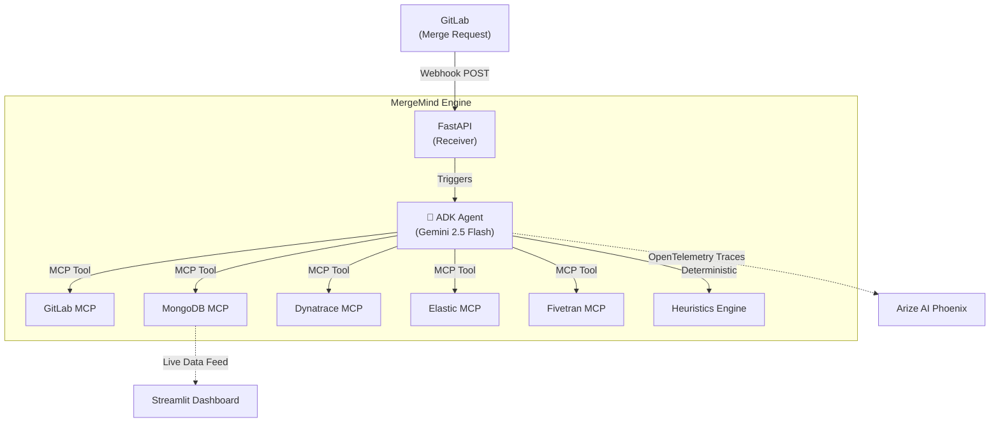

# 🧠 MergeMind

> **The Universal AI Arbitration Engine for Code Contributions**

Built for the **Google Cloud Rapid Agent Hackathon 2026** 🏆

MergeMind is an autonomous AI agent built on **Google Cloud Agent Builder (ADK)** and powered by **Gemini 2.5 Flash**. It intercepts code contributions (GitLab Merge Requests), evaluates them across multiple quality dimensions using deterministic heuristics, and automatically streams payment via a smart ledger.

It completely replaces subjective human code reviews for bounties with objective, lightning-fast, and transparent AI arbitration.

---

## 🌟 The 6-Partner Integration Engine

MergeMind is a showcase of the **Model Context Protocol (MCP)**, effortlessly orchestrating 6 different enterprise tools into a single, cohesive workflow:

1. **GitLab MCP:** Fetches Merge Request code diffs, reads file context, and posts the final evaluation score directly as a PR comment.
2. **MongoDB MCP:** The streaming financial ledger. The agent reads `budget_pools` to check for available escrow and writes transaction receipts to the `streaming_ledger`.
3. **Dynatrace MCP:** Production health intelligence. Before approving high-impact code, the agent dynamically queries the live environment to ensure no vulnerabilities or system degradations are active.
4. **Fivetran MCP:** Data pipelines. The agent can trigger an automatic sync of the MongoDB ledger to an external data warehouse for downstream analytics.
5. **Elastic MCP:** The knowledge base. The agent indexes a summary of its evaluation into Elasticsearch, acting as a highly searchable database of past arbitration decisions.
6. **Arize AI:** OpenTelemetry observability. Every prompt, tool call, and LLM reasoning step is traced and visible in the Arize dashboard, completely solving the "black box" problem of AI agents.

---

## 🏗️ Architecture



---

## 🛡️ The Anti-Gaming Heuristics Engine

AI evaluations are vulnerable to developers "gaming" the system (e.g., generating 500 lines of useless code to inflate their score).

MergeMind prevents this by routing all code through a **deterministic Python Heuristics Engine** *before* the LLM sees it. It extracts hard mathematical metrics:
- Net line delta vs. Cyclomatic Complexity
- Ratio of source files to test files modified
- Detection of "config-only" changes masquerading as features

The agent uses these strict metrics alongside the raw code to detect "AI-generated bloat" and flag it with `is_suspicious: true`, instantly rejecting the payment and protecting the budget.

---

## 🚀 Quick Start

### 1. Clone & Install
```bash
git clone https://github.com/AdhamSattawi/MergeMind.git
cd MergeMind

# Create an isolated python environment
python -m venv venv
# Windows
.\venv\Scripts\Activate.ps1
# Mac/Linux
source venv/bin/activate

pip install -r requirements.txt
```

### 2. Configure Environment
```bash
cp .env.example .env
# Edit .env and add your API keys (Google, GitLab, MongoDB, Arize, Dynatrace, Elastic, Fivetran)
```

### 3. Start the Core Agent (Docker)
The FastAPI server and ADK Agent run in a robust Docker container:
```bash
docker-compose up -d --build
```

### 4. Run the Streamlit Dashboard
To view the beautiful, real-time premium dashboard, run Streamlit locally from your virtual environment:
```bash
streamlit run dashboard/app.py
```
> The dashboard will open at `http://localhost:8501`

### 5. Test the Engine
Simulate a live GitLab Merge Request webhook event:
```bash
python scripts/simulate_webhook.py
```
Watch the terminal or your Arize dashboard as the agent begins reasoning!

---

## 💡 Real-World Use Cases

1. **Open Source Bounties (Liquid Payments):** Automatically pay contributors for merged PRs based on the quality and impact of their code.
2. **HR Screening:** Evaluate candidate take-home assignments objectively without taking up senior engineering time.
3. **Performance Reviews:** Track the "Impact Score" of developers over a year, ignoring trivial line counts and focusing on architectural value.

---

## 📜 License

MIT License. See `LICENSE` for details.
