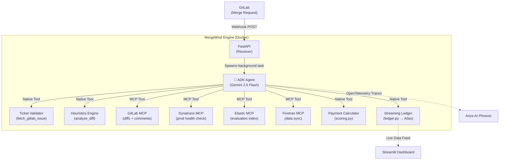

# 🧠 MergeMind

> **The AI-Assisted Arbitration Engine for Code Contributions**

[](https://python.org)
[](https://google.github.io/adk-docs/)
[](https://deepmind.google/gemini/)
[](https://fastapi.tiangolo.com/)
[](https://www.mongodb.com/atlas)
[](LICENSE)

Built for the **Google Cloud Rapid Agent Hackathon 2026** 🏆

---

MergeMind is a fully autonomous AI agent that intercepts GitLab Merge Requests via webhook, evaluates the code across multiple quality dimensions, validates it against a business ticket, and streams an automated payment to the contributor — all without any human intervention.

It completely replaces subjective code reviews for bounty programs with **objective, auditable, and lightning-fast AI arbitration**.

---

## 🌟 Key Features

- **🎫 Ticket Validation Loop** — The agent fetches the linked GitLab Issue and performs a strict binary relevance check. If the code doesn't solve the referenced ticket, the MR is instantly rejected. No ticket reference = instant rejection.
- **🔍 Deterministic Heuristics Engine** — Before the LLM evaluates anything, a pure Python heuristics engine extracts hard mathematical metrics from the diff (line delta, file type ratios, test coverage presence, complexity). This data anchors the AI's reasoning in objective fact.
- **🛡️ Anti-Gaming Detection** — The agent actively detects AI-generated bloat, trivial changes, and copy-paste padding. Suspicious submissions are flagged `is_suspicious: true` and immediately assigned a score of 0.
- **💸 Deterministic Payment Controls** — The agent assigns a score (0–100); all payment math is handled by deterministic Python code reading `max_payment_per_mr` from the environment. The LLM cannot hallucinate or manipulate the payout amount.
- **📊 Real-Time Streaming Dashboard** — A live Streamlit dashboard pulls from MongoDB Atlas to visualize the ledger, impact score trends, and budget burndown as evaluations happen.
- **🔭 Full Observability** — Every LLM reasoning step, tool call, and token is traced via OpenTelemetry to Arize AI Phoenix, completely solving the black-box problem.

---

## 🏗️ Architecture



> **Note on MongoDB:** The MongoDB financial ledger uses a **native `pymongo` integration** (`src/tools/ledger.py`) rather than an MCP server. This was a deliberate architectural decision for reliability — the official MongoDB MCP server performs aggressive schema introspection on Atlas that caused consistent connection timeouts. The native integration is faster, more predictable, and fully transactional.

---

## 🔄 Evaluation Workflow

When a GitLab Merge Request is opened or updated:

1. **GitLab sends a webhook** → FastAPI receives and immediately returns `202 Accepted`
2. **Background task spawns** → The ADK Agent is initialized with all tools
3. **Ticket Validation** → Agent fetches the linked Issue (e.g., `Closes #32`) and checks code relevance. Rejects immediately if irrelevant or no ticket linked.
4. **Diff Fetching** → `fetch_gitlab_mr_diff` retrieves the unified diff directly from the GitLab API
5. **Heuristics Analysis** → `analyze_diff` extracts: lines added/removed, files modified, test coverage ratio, complexity indicator, suspicious patterns
6. **Code Evaluation** → Gemini 2.5 Flash scores the code across 4 dimensions using the diff + heuristics data
7. **Dynatrace Health Check** → Agent queries production environment for active vulnerabilities or degradations
8. **Budget Check** → `check_budget` reads the project's remaining escrow from MongoDB Atlas
9. **Payment Calculation** → `calculate_payment` deterministically computes payout: `(score / 100) × max_payment_per_mr`, capped at remaining budget
10. **Ledger Recording** → `record_evaluation_and_payment` atomically deducts budget and writes the transaction to `streaming_ledger`
11. **Elastic Indexing** → Evaluation summary indexed to Elasticsearch for historical searchability
12. **MR Comment Posted** → Structured evaluation report posted directly to the GitLab Merge Request
13. **Arize Trace Finalized** → Full reasoning trace available in Arize Phoenix dashboard

---

## 🧩 Partner Integrations

| Partner | Integration Type | Role in MergeMind |
|---|---|---|
| **GitLab** | MCP Server + Native API | Fetch diffs, read file context, post MR comments, fetch linked issues |
| **MongoDB Atlas** | Native (`pymongo`) | Streaming financial ledger (`streaming_ledger`) + budget escrow (`budget_pools`) |
| **Dynatrace** | MCP Server | Query live production health before approving high-impact code |
| **Elastic** | MCP Server | Index evaluation summaries as a searchable knowledge base of past decisions |
| **Fivetran** | Custom MCP Server | Trigger data sync from MongoDB ledger to external data warehouses |
| **Arize AI** | OpenTelemetry / Phoenix | Full LLM observability — traces every prompt, tool call, and reasoning step |

---

## 📐 Scoring Criteria

The agent produces an `impact_score` (0–100) as a **weighted average** of four dimensions:

| Dimension | Weight | What it measures |
|---|---|---|
| `logic_and_efficiency` | 30% | Algorithmic correctness, time/space complexity, optimization |
| `architectural_soundness` | 25% | Modularity, SOLID principles, separation of concerns |
| `robustness_and_security` | 25% | Exception handling, input validation, security anti-patterns |
| `test_coverage_contribution` | 20% | Quality and relevance of new/modified tests |

**Payment formula:** `payment = (impact_score / 100) × MAX_PAYMENT_PER_MR`  
The `MAX_PAYMENT_PER_MR` cap is set in your `.env` file — the LLM has no control over this value.

---

## 🗂️ Project Structure

```
MergeMind/
├── main.py                        # FastAPI app entry point (CORS, health check, router)
├── docker-compose.yml             # App + MongoDB services
├── Dockerfile                     # Python 3.11-slim multi-stage build
├── requirements.txt
├── .env.example                   # Environment variable template
│
├── config/
│   └── settings.py                # Pydantic Settings — loads all env vars
│
├── src/
│   ├── agent/
│   │   ├── arbitration_agent.py   # ADK Agent definition + all MCP toolsets
│   │   └── prompts.py             # ARBITRATION_SYSTEM_PROMPT (workflow, scoring, output format)
│   │
│   ├── api/
│   │   └── webhooks.py            # POST /api/v1/webhooks/gitlab — receives & dispatches MR events
│   │
│   ├── models/
│   │   ├── gitlab_payload.py      # Pydantic V2 models for GitLab webhook payloads
│   │   ├── evaluation.py          # CodeEvaluation, EvaluationMetrics models
│   │   └── ledger.py              # BudgetPool, LedgerEntry models
│   │
│   ├── tools/
│   │   ├── heuristics.py          # analyze_diff — deterministic diff metrics extractor
│   │   ├── scoring.py             # calculate_payment — deterministic score → payment converter
│   │   ├── ledger.py              # Native pymongo: check_budget, record_evaluation_and_payment
│   │   ├── elastic_writer.py      # index_evaluation_to_elastic — custom Elastic writer
│   │   └── fivetran_mcp/          # Custom Fivetran MCP server implementation
│   │
│   └── observability/
│       └── tracer.py              # Arize Phoenix OpenTelemetry setup
│
├── dashboard/
│   └── app.py                     # Streamlit real-time dashboard
│
└── scripts/
    ├── simulate_webhook.py        # Fire a mock GitLab MR webhook for testing
    └── seed_budget.py             # Seed a BudgetPool document into MongoDB
```

---

## 🚀 Quick Start

### Prerequisites
- Docker Desktop
- Python 3.11+
- API keys for: Google Cloud (Gemini), GitLab, MongoDB Atlas, Arize, Dynatrace, Elastic, Fivetran

### 1. Clone & Configure
```bash
git clone https://github.com/AdhamSattawi/MergeMind.git
cd MergeMind

cp .env.example .env
# Fill in your API keys in .env
```

### 2. Start the Engine
```bash
docker-compose up -d --build
# FastAPI + ADK Agent available at http://localhost:8000
```

### 3. Seed the Budget Pool
```bash
# Activate your venv first
python -m venv venv && source venv/bin/activate  # Mac/Linux
# or: .\venv\Scripts\Activate.ps1               # Windows

pip install -r requirements.txt
python scripts/seed_budget.py
```

### 4. Launch the Dashboard
```bash
streamlit run dashboard/app.py
# Opens at http://localhost:8501
```

### 5. Simulate a Live Evaluation
```bash
python scripts/simulate_webhook.py
# Watch the agent reason in real time via: docker-compose logs app -f
```

---

## 💡 Real-World Use Cases

1. **Open Source Bounties** — Automatically pay contributors for merged PRs based on code quality and impact, not line count.
2. **HR Technical Screening** — Evaluate take-home assignments objectively without consuming senior engineering time.
3. **Developer Performance Reviews** — Track an engineer's `impact_score` over time, ignoring trivial changes and focusing on architectural value.
4. **EdTech / Coding Education** — Grade student assignments with full feedback, checking if their code actually solves the stated problem (via the Ticket Validation Loop).

---

## 📜 License

MIT License. See [LICENSE](LICENSE) for details.

---

*Built with ❤️ for the Google Cloud Rapid Agent Hackathon 2026*
