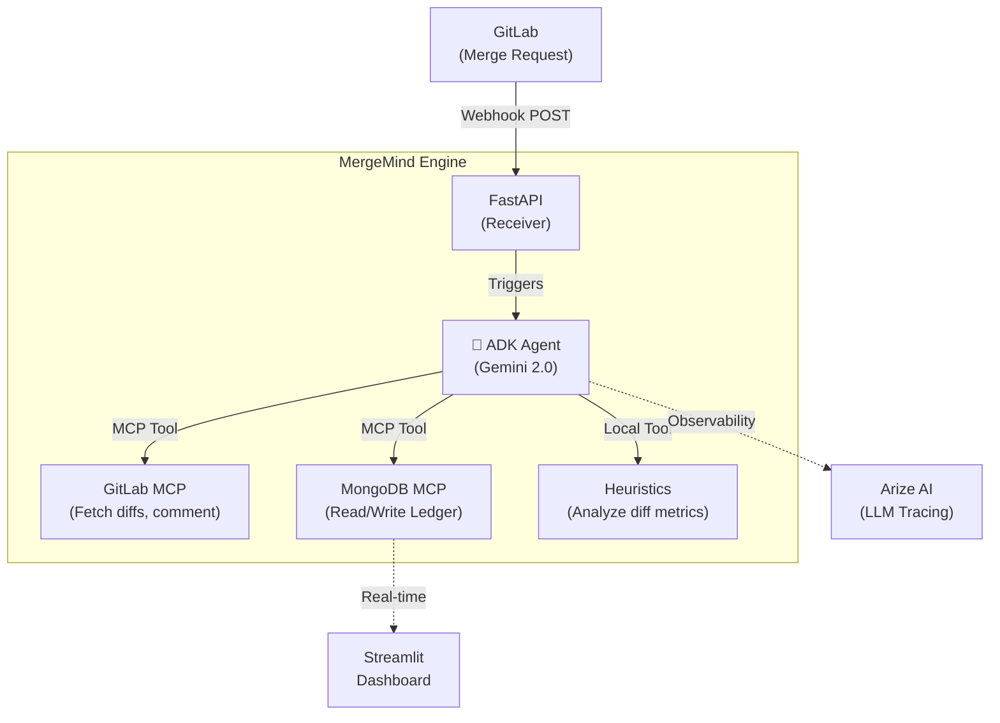

# 🧠 MergeMind

> **AI-Assisted Arbitration Engine for Code Contribution Evaluation**

Built for the **Google Cloud Rapid Agent Hackathon 2026** 🏆

MergeMind is an autonomous AI agent built on Google Cloud Agent Builder (ADK) that intercepts code contributions, evaluates them on multiple quality dimensions using deterministic heuristics and Gemini 2.0, and automatically streams payment via a smart ledger. It replaces subjective human code reviews for bounties with objective, fast, and transparent AI arbitration.

## 🏗️ Architecture



## 🛠️ Tech Stack

- **Agent Framework:** Google Cloud Agent Builder (ADK)
- **Model:** Gemini 2.0 Flash
- **Backend:** Python 3.11, FastAPI, Pydantic V2
- **Database / Ledger:** MongoDB Atlas (Time Series)
- **Tool Connectivity:** Model Context Protocol (MCP) servers
- **Observability:** Arize Phoenix
- **UI (Demo):** Streamlit

## 🚀 Quick Start

1. **Clone the repository:**
   ```bash
   git clone https://github.com/AdhamSattawi/MergeMind.git
   cd MergeMind
   ```

2. **Configure Environment:**
   ```bash
   cp .env.example .env
   # Edit .env and add your API keys (Google, GitLab, MongoDB, Arize)
   ```

3. **Start the Infrastructure (Docker):**
   ```bash
   docker-compose up -d
   ```

4. **Run the Dashboard (Optional):**
   ```bash
   streamlit run dashboard/app.py
   ```

## 💡 Use Cases

1. **Open Source Bounties (Liquid Payments):** Automatically pay contributors for merged PRs based on the quality and impact of their code.
2. **HR Screening:** Evaluate candidate take-home assignments objectively without taking up engineering time.
3. **Performance Reviews:** Track the "Impact Score" of developers over a year, ignoring trivial line counts and focusing on architectural value.

## 📜 License

MIT License. See `LICENSE` for details.
